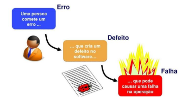

# Gestão de defeitos (bugs) e retestes 

Erros, defeitos, falhas e causas-raiz? 

Por hábito, todo comportamento não previsto encontrado durante os testes são reportados como bug, mas você sabia que nem tudo realmente é um bug? Existem definições teóricas, inclusive abordadas pelo ISTQB para que possamos diferenciar e tratar cada tipo de comportamento individualmente a fim de colher os melhores resultados durante o processo de teste.  

- **Falha** é o resultado incorreto observado no sistema. É aquele comportamento errado que detectamos durante os testes. 

- **Defeitos** são os chamados bugs que existem no código desenvolvido. 

- **Erros** são cometidos por uma ação humana, ou seja, o desenvolvedor que codificou. 

- **Causa-raiz** é o que motivou o erro a ser cometido e estas podem ser diversas, como pobreza de informações em documentações de negócio, distração, não entendimento de uma regra, ambiguidade de requisitos, falta de experiência na função etc. 

Sabendo disso, a correta gestão de defeitos (bugs) nos proporciona visibilidade e rastreabilidade de problemas e pode nos prover informações para resolver a causa-raiz que motivou o erro e por consequência, criou o bug gerando uma falha no sistema. 

## Gestão de defeitos (bugs):  

- Bugs podem ser encontrados através de testes manuais, testes automatizados, feedback dos usuários, e análise de logs. 

- Cada bug deve ser registrado na ferramenta de gerenciamento do projeto para ter rastreabilidade e, ter o correto direcionamento e deve ser registrado no Task/Mandala obrigatoriamente com as seguintes informações: 

### Título do Bug

Utilizar padrão _"**[SEVERIDADE][TIPO] Resumo do Bug encontrado"**_

Exemplos: 

> **[MD][INT] Tela usuários - Módulo dependentes: Ao cadastrar um dependente tipo do dado Data de Nascimento não está sendo persistido no banco de dados** 

> **[BX][LT] Tela usuários - Módulo dependentes: Elemento Nome não está quebrando linha na tela prejudicando o layout**

### Severidade 

- [CR] = Crítica
- [GR] = Grave
- [MD] = Moderada
- [BX] = Baixa 

Onde: 

**Crítica [CR]:** Impede um processo, causa travamento na aplicação nas principais Features/Funcionalidades, não existe um workaround (contorno):

- Botão não funciona, impedindo o uso/teste da feature 

- Feature/Funcionalidade esperada não aparece na versão que está sendo testada 

- Perda grave de dados 

- “Fatal error” 

- Funcionalidade desenvolvida em desacordo com os requisitos especificados (desvio significativo) 

- Incompatibilidade com o browser ou outros itens de ambiente (se for operação do projeto) 

- Segurança (como senhas expostas no banco) 

- Cálculo de valores errados gerando possíveis perdas para o cliente 

**Grave [GR]:** Comprometimento da funcionalidade, sistema travando ou se comportando de maneira não prevista, existe um workaround (contorno), porém complexo 

- Bug em funcionalidade essencial do produto 

- Comprometimento moderado da continuidade dos testes 

- Funcionalidade desenvolvida em desacordo com os requisitos especificados (desvio moderado) 

- Problemas perceptíveis de desempenho com razoável impacto no uso normal da aplicação 

- Regras de validação de campos não aplicadas corretamente (Ex.: data inválida e valor fora da faixa) baseado no requisito 

**Moderada [MD]:** Problemas moderados em funcionalidades do produto, existe um workaround (contorno) simples. Baixo impacto nos testes 

- Mensagem de erro/sucesso não apresentada 

- Foco incorreto do cursor 

- Imagens não carregadas 

- Erros de ordenação/quebra em consultas e relatórios 

- Termos inadequados/fora do contexto 

- Campos, botões, regiões com cores ou opacidade muito diferentes dos especificados em protótipo 

**Baixa [BX]:** Feature/Funcionalidade sofre pouquíssimo ou quase nenhum impacto, mas ainda é um erro válido e que precisaria ser corrigido, se possível 

- Erro ortográfico 

- Pequenos erros na interface no geral 

- Alinhamento de campos 

- Falta de clareza em mensagens para o usuário 

- Campos, botões, regiões com cores ou opacidade levemente diferentes dos especificados em protótipo 

### Tipo 

- [API] - Erros encontrados na API ocasionados no código no desenvolvimento de back 

- [BD] - Erros encontrados no Banco de dados ocasionados por dados inválidos ou por incoerência de dados 

- [DC] - Erros encontrados na Documentação ocasionado devido a falta de especificação da funcionalidade ou especificado de forma incorreta 

- [EA] - Erros encontrados na acessibilidade do sistema ocasionados com a complexidade da interface do sistema, dificultando o acesso e entendimento e consequentemente a obtenção de informações. Erros que impedem o entendimento na usabilidade do usuário com e sem alguma deficiência. 

- [LT] - Erros encontrados no Layout do sistema ocasionados na parte visual do sistema, ex: posição dos parágrafos, tabulações, ortografia, textos, alinhamentos, botões, cores, linhas, padrões, responsividade da tela, ordenação de filtros, etc 

- [RN] - Erros encontrados na Regra de Negócio ocasionados devido a falta de entendimento dos requisitos descritos, ou quando encontrado divergências dos critérios de aceite descritos nas User Stories 

- [INF] - Erros encontrados na Infraestrutura ocasionados em virtude de problemas com a infra de servidores, ex: energia e conexões de rede instável, atualizações de sistemas internos, manutenção etc 

- [INT] - Erros encontrados na Integração ocasionados na comunicação entre sistemas 

- [DEV] - Erros encontrados no Desenvolvimento causado em virtude do código implementado de forma errada do desenvolvedor. 

- [AMB] - Erros encontrados no Ambiente causado por configuração de ambiente utilizado para teste. 

- [OUT] - Erros diversos (Outros) que não tem relação com itens acima. 

 

### Como reportar um bug após sua classificação 

Para manter a rastreabilidade e confiabilidade dos dados reportados, a descrição do bug na ferramenta de gestão do projeto deve conter o mínimo de informações necessárias para se reproduzir o problema e, informar de forma objetiva qual o resultado que se espera após a correção.  

**_Sugestão de descrição de bug:_**

**[AMBIENTE]**

Pode-se inserir informações como: 

- Ambiente no qual ocorreu o bug 

- Links de portais, dados de acesso, endereço do banco de dados, usuários do banco, etc 

- Versão do Sistema 

- Navegador utilizado 

- Qualquer outra informação que achar pertinente relacionado ao ambiente 

 

**[DESCRIÇÃO/PROBLEMA]**

Descrever um passo-a-passo ou um resumo para tentar simular o bug. 
Se necessário, pode anexar evidências do bug como: 

- Screenshot 

- Vídeos 

- GIF 

**[RESULTADO ESPERADO]**

Descrever comportamento esperado se o bug não ocorresse, baseado em: 

- Regras de Negócios existentes 

- Trechos de Requisitos 

- Protótipos 

- Padrões ou Convenções comumente aplicados em módulos do próprio sistema ou sistemas similares 

- Alinhamento entre interessados 

Se necessário, colocar evidência do resultado esperado como: 

- Screenshot 

- Vídeos 

- GIF 

## Reteste 

Para que o reteste do bug possa ser efetuado, é importante garantir que o bug seguirá o processo dentro do desenvolvimento: 

 1. **Análise:** 
    - O desenvolvedor responsável pelo bug analisa o problema, reproduz o erro e identifica a causa. 

2. **Correção:**
   - O desenvolvedor corrige o código conforme a análise. As correções devem ser realizadas em um ambiente de desenvolvimento e submetidas para revisão. 

3. **Revisão:**
   - A correção é revisada e testada para garantir que o problema foi resolvido sem introduzir novos problemas. 

4. **Reteste QA:**
   - Após a correção, o bug deve ser liberado para o reteste no ambiente em que o erro foi reportado. 

   - O reteste deve ser realizado pelo QA e seguir os mesmos passos que foram usados para reproduzir o bug originalmente. 

   - Se necessário, realizar testes adicionais para garantir que a correção não causou problemas em outras partes do sistema. Isso pode incluir testes de regressão. 

   - Após a validação, deve-se atualizar a documentação do bug com resultados dos testes e qualquer informação adicional relevante. 

5. **Fechamento:**
   - Após a confirmação de que o bug foi resolvido e a correção não causou problemas adicionais, o status do bug pode ser atualizado para seguir na esteira de desenvolvimento. 

   - As horas trabalhadas no bug devem ser apontadas e a triagem no Task/Mandala encerrada.