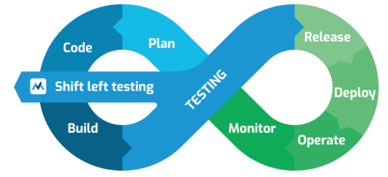

# Abordagem Shift-Left

A Abordagem Shift-Left é uma estratégia de teste que envolve a execução de testes mais cedo no ciclo de vida de desenvolvimento de software. O princípio do teste antecipado, é muitas vezes referido como "shift-left" porque desloca as atividades de teste "para a esquerda" no processo de desenvolvimento. 

Normalmente, o shift-left sugere que os testes sejam realizados o mais cedo possível (por exemplo, sem esperar que o código seja implementado ou que os componentes sejam integrados). No entanto, é importante ressaltar que essa abordagem não significa que os testes realizados em etapas posteriores do processo devam ser negligenciados. Pelo contrário, testes em todas as fases continuam sendo cruciais para garantir a qualidade do software. 

## Boas práticas para implementar o shift-left 

- **Revisão da especificação sob a perspectiva de testes:** Realizar revisões das especificações (requisitos, histórias de usuário, etc.) do ponto de vista de testes. Essas atividades de revisão frequentemente identificam defeitos potenciais, como ambiguidades, incompletude e inconsistências. 

- **Escrita de casos de teste antes do código:** Desenvolver casos de teste antes que o código seja escrito. Isso permite que o código seja desenvolvido para passar nos testes definidos, promovendo um desenvolvimento orientado a testes (TDD - Test-Driven Development). 

- **Uso de integração contínua (CI) e, melhor ainda, de entrega contínua (CD):** Essas práticas permitem feedback rápido e testes automatizados de componentes para acompanhar o código-fonte sempre que ele é enviado ao repositório de código. O uso de CI/CD promove o shift-left ao integrar testes automatizados em cada etapa do ciclo de desenvolvimento (QA pode solicitar uma gestão de builds mais eficientes caso identifique que o processo carece um processo CI/CD mais bem definido, executado). 

- **Análise estática do código-fonte:** Realizar análises estáticas do código-fonte antes do teste dinâmico ou como parte de um processo automatizado. A análise estática ajuda a identificar defeitos sem a necessidade de executar o código. 

- **Testes não funcionais no nível de teste de componente:** Realizar testes não funcionais (como desempenho, segurança, etc.) o mais cedo possível, preferencialmente no nível de componente. Isso é uma forma de shift-left, pois tradicionalmente esses tipos de testes são realizados em fases posteriores do processo, quando o sistema completo e um ambiente de teste representativo estão disponíveis. Tradicionalmente, esses testes são realizados pelo desenvolvedor, mas o QA pode monitorar a evolução e execução destes testes. 

- **Automação de processos de teste e configuração de pipelines de CI/CD:** Embora em muitos momentos o código a ser testado ainda não esteja pronto, o QA pode trabalhar na configuração de ambientes de teste, pipelines de CI/CD, e automação de testes para garantir que, assim que o código seja submetido, ele seja imediatamente validado contra um conjunto de testes. 

## Benefícios e desafios da abordagem shift-left 

A adoção de uma abordagem shift-left pode envolver treinamento, esforço e custos adicionais no início do processo. No entanto, espera-se que essa abordagem resulte em benefícios como economia de esforços e custos nas fases finais do desenvolvimento, ao identificar e corrigir defeitos mais cedo, antes que se tornem mais complexos e caros de corrigir. Alguns dos benefícios que podem ser observados com o uso desta abordagem: 

- **Redução de custos e retrabalho:** Defeitos encontrados no início do ciclo de desenvolvimento são mais baratos de corrigir. Por exemplo, um defeito detectado na fase de requisitos pode custar até 100 vezes menos para corrigir do que se fosse encontrado em produção. Isso reduz custos gerais e evita retrabalho significativo. 

- **Aceleração de entregas:** Com testes automatizados e integrações contínuas realizadas desde o início, a equipe pode obter feedback rápido e corrigir problemas imediatamente. Isso permite entregas mais frequentes e ágeis, reduzindo o tempo de lançamento no mercado e aumentando a competitividade. 

- **Melhoria da qualidade do produto:** Testes antecipados permitem que problemas críticos, como falhas de desempenho e segurança, sejam identificados antes que o sistema esteja completo. Isso resulta em produtos mais robustos e menos propensos a falhas em produção, melhorando a satisfação do cliente e a reputação da empresa. 

- **Mitigação de riscos:** A identificação precoce de riscos técnicos e de negócio facilita a priorização de testes críticos e o planejamento de estratégias de mitigação. Com uma abordagem proativa, a equipe evita surpresas de última hora que podem impactar cronogramas e orçamentos. 

- **Foco na colaboração e alinhamento:** Ao envolver QA, desenvolvedores e stakeholders desde o início, o Shift-Left promove uma comunicação mais eficaz, alinhando todos os envolvidos sobre os objetivos de qualidade e reduzindo mal-entendidos. Isso resulta em uma equipe mais coesa e em um desenvolvimento mais eficiente. 